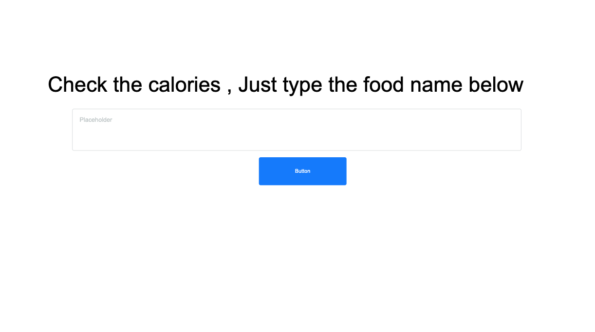
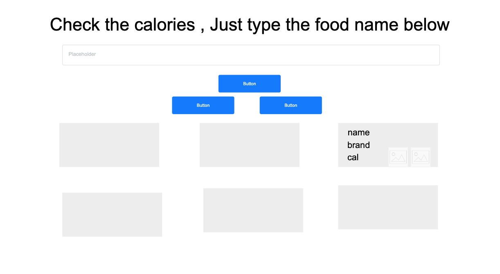
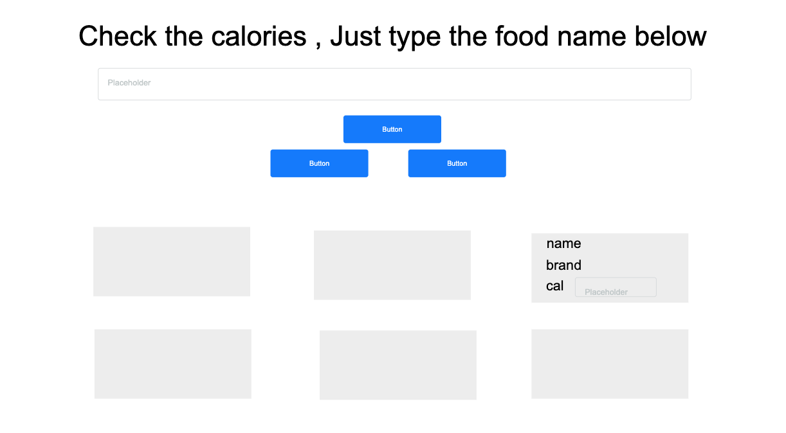

# Project2 - Nutrition Data

## Descripition

 Nutrition Data , it's a website to calculate the calories of food , you can serach for the food you want and find the brand and calories for each result , and you can add products to favorite list to back to it again .

## Technologies

- react .
- java script .
- css .
- java script .
- boostrap .

## user stories

- As a user i can search for any food and take a response as list of products .
- AS a user i can add the product to
calories list .
- AS a user i can add the product to
favorite list .
- As user i can view list of products if i click in calories list .
- As a user i can get the result of the sum of the products calories .
- As a user i can edit the calories i already add it to calories list .
- As user i can view list of products if i click in favorite list .
- As a user i can delet any product
from favorite list .
- As a user i can delete all products
when ic click remove all .
- As a user i can delete products with checked box .


## Code Examples

### calculate the calories

``` java scrpit

total = this.props.caloris.reduce((firstNumber , secondNumber)=> firstNumber+secondNumber)}
   ```

take the prpos of calories array and sum it by using reduce .

## Usage

first write any food to search about it ---> then click search  ---> click the cal button to add product to calories list  ---> click the heart button to add product to favorite list ---> click favorite list to show the products you favorite ---> click calories list to show the products you add it .

## wireframe





